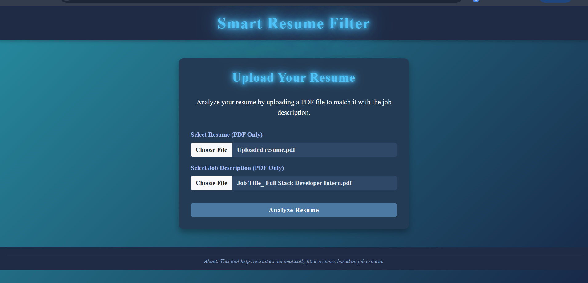
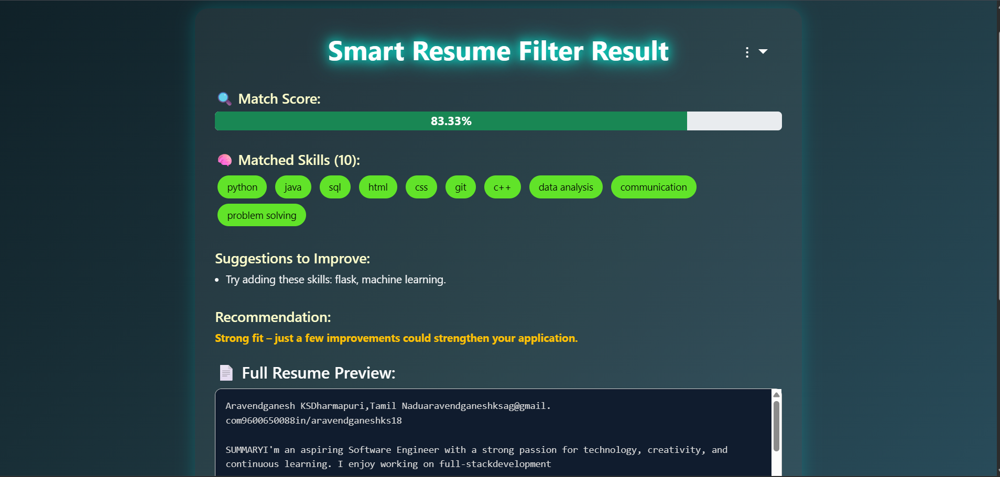
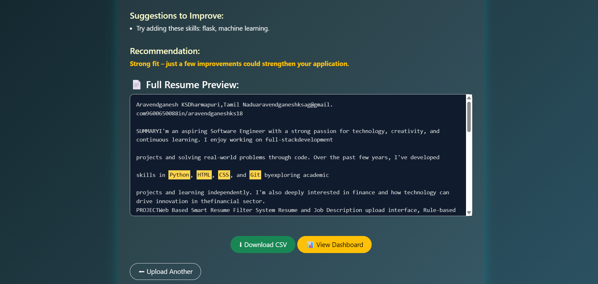
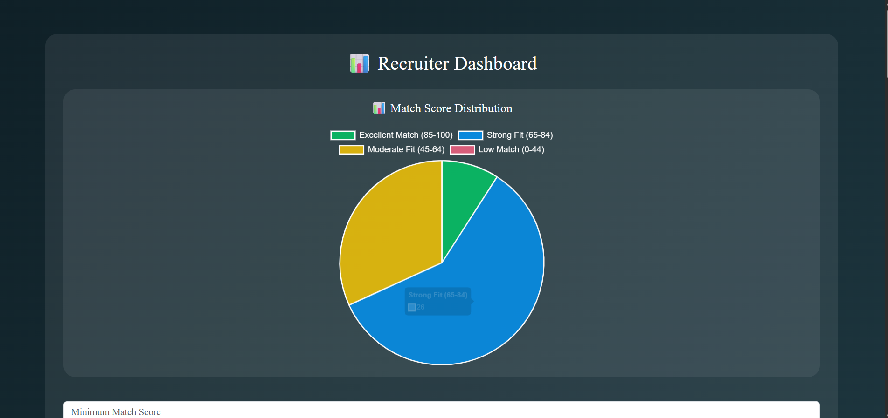
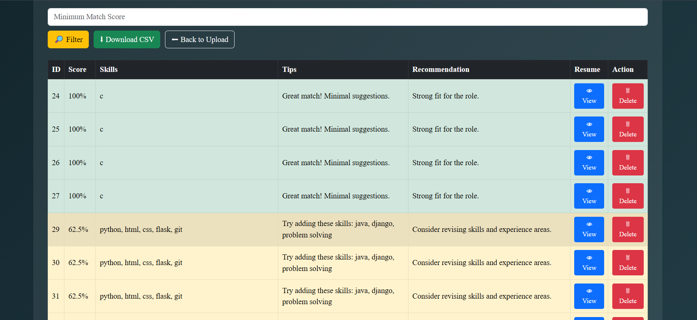

### 📥 Upload Page Preview


### 📊 Resume Result Analysis


### 📄 Resume Text Preview


### 📈 Recruiter Dashboard with Chart


### 🧑‍💼 Resume Sorting in Dashboard


# 🧠 Smart Resume Filter System

## 👨‍💻 About Me

I am **Aravendganesh KS**, a 4th-year student from the Computer Science and Business Systems (CSBS) department.  
This project was developed as part of my industrial training to solve real-world problems in the recruitment domain using a rule-based resume filtering system.

---

## 🚀 Project Overview

The Smart Resume Filter System is a web-based tool that automates the resume screening process.  
It extracts key information from resumes and compares them to job descriptions (JD) using rule-based keyword matching to calculate a match score, highlight relevant skills, and provide improvement suggestions.

---

## 🔍 Features

- 📄 Upload resumes in `.pdf` or `.txt` formats along with job descriptions
- 🧠 Extracts skills and keywords from both documents
- ✨ Highlights matched keywords in the resume preview
- 📊 Calculates a match score between resume and job description
- 💡 Provides personalized improvement suggestions
- 📌 Generates recruiter recommendations
- 💾 Stores all results in a SQLite database
- 📋 Recruiter dashboard with filtering, deletion, CSV export
- 🥧 Pie chart visualization of score distribution

---

## 🛠 Technologies Used

| 🧪 Technology    | ⚙️ Purpose                              |
|------------------|------------------------------------------|
| Python           | Backend development                     |
| Flask            | Web framework                           |
| pdfminer.six     | PDF text extraction                     |
| HTML / CSS       | Frontend structure and layout           |
| Bootstrap        | Responsive styling                      |
| SQLite           | Resume result storage                   |
| Matplotlib       | Chart visualization (pie chart)         |

---

## 📁 Folder Structure


Smart-Resume-Filter-System/
├── app.py # Main Flask backend logic
├── your_resume_parser.py # Resume & JD analysis logic
├── resume_data.db # SQLite database (auto-created)
├── templates/
│ ├── upload.html
│ ├── analyze.html
│ └── dashboard.html
├── static/
│ └── style.css (if used)
├── assets/
│ └── demo.png (optional screenshot)
├── .gitignore
├── requirements.txt
└── README.md


-----------------------------------------------------------------------------

---

## ⚙️ Getting Started

### Setup Instructions

```bash
# Clone the repository
git clone https://github.com/Arav-18/Smart-Resume-Filter-System.git

# Navigate into the project folder
cd Smart-Resume-Filter-System

# Create virtual environment (optional)
python -m venv venv
venv\Scripts\activate      # On Windows

# Install dependencies
pip install -r requirements.txt

# Run the application
python app.py

Then open your browser and go to:

arduino
Copy
Edit
http://localhost:5000

